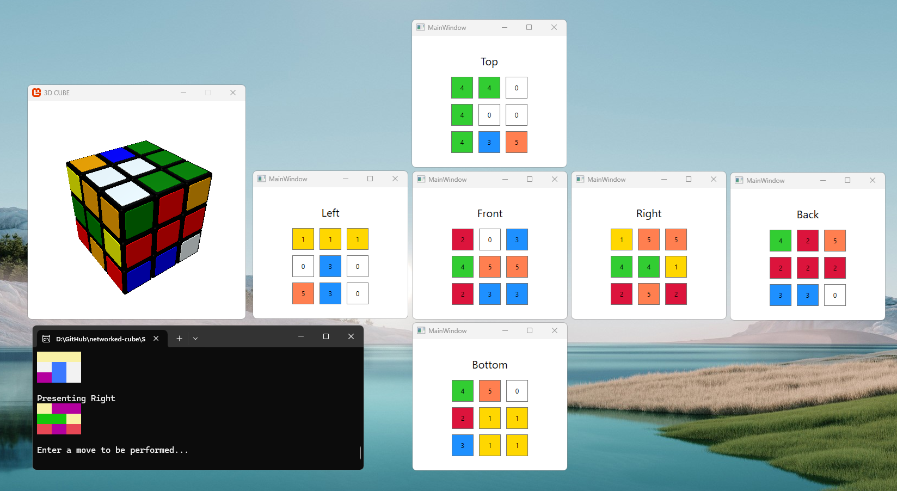
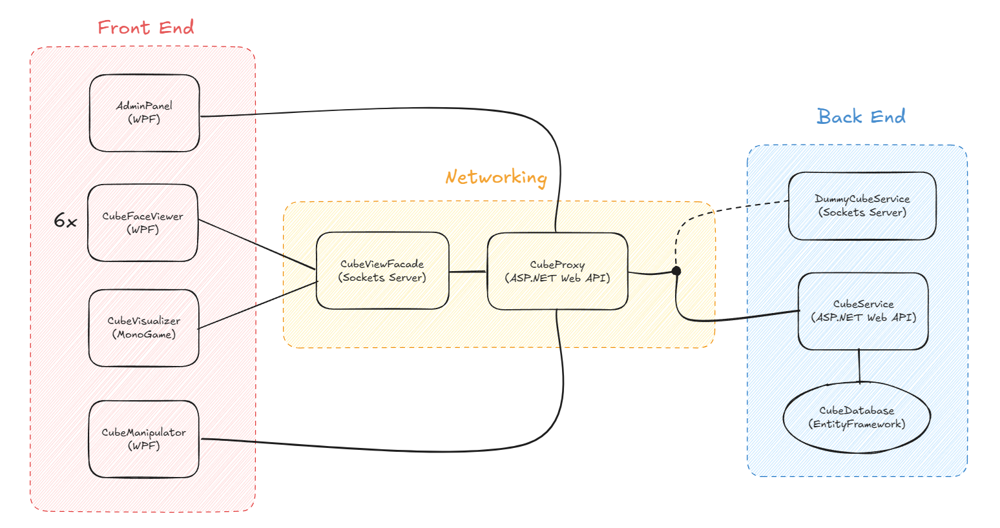

# netcube

A light-hearted networking exercise with a puzzle cube theme. 

The end goal is a suite of networked applications that can be self-hosted on a single machine to present a cube that can be scrambled and solved.

The cube is presented as a dice-map in the same manner as used for [Old Pochman](https://www.speedcubereview.com/blind-solving-algorithms.html).

#### Screenshot

#### Design

#### Usage

1. Open Solution/Solution.sln in Visual Studio
2. Run DummyService
3. Run ViewProxy (to be replaced by CubeViewFacade in future)
4. Run FaceViewer 6 times, launching 6 WPF applications
5. Press the face title button in the WPF face viewers to change the displayed faces
6. Run FaceViewerCLI, which allows supported moves to be performed: U, R, L, D, F, B

#### Contributing

If you know me personally, you are welcome to contribute to this project.

Anticipated additions to the project are listed as [issues](https://github.com/eeoooue/netcube/issues). Let me know if you spot anything that interests you, or if you have any other ideas for the project.

