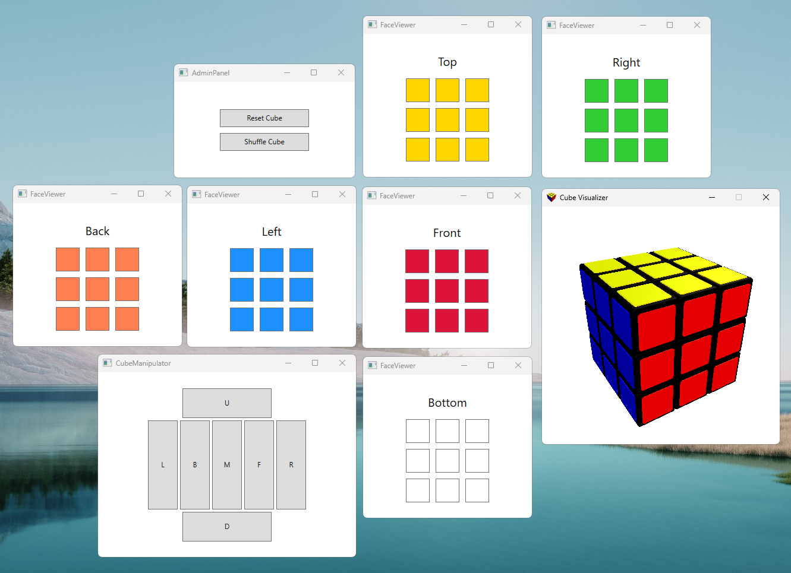

# networked-cube

A light-hearted networking exercise with a puzzle cube theme. 

The end goal is a suite of networked applications that can be self-hosted on a single machine to present a cube that can be scrambled and solved.

The puzzle is presented as a cube map in the same manner as in [Old Pochman](https://www.speedcubereview.com/blind-solving-algorithms.html).
 
## Screenshot



## Design


## Usage

### Setup
1. Open ```Solution/Solution.sln``` in Visual Studio
2. Run **DummyService**
3. Run **CubeViewFacade**
4. Run **FaceViewer** 6 times, launching 6 WPF applications
5. Press the face title button in the WPF face viewers to change the displayed faces
6. Run **FaceViewerCLI**

### Moves
You can use standard cube notation to input moves. These are:
- **U** will rotate the top row right.
- **D** will rotate the bottom row right.
- **R** will rotate the right column upwards.
- **L** will rotate the left column downwards.
- **F** will rotate the front face clockwise.
- **B** will rotate the back face counter-clockwise.
- **M** will rotate the middle column downwards.

You can use the **{move}'** notation to do a move in reverse. An example would be **U'** to rotate the top row left.

You can use the **{move}2** notation to do a move twice. An example would be **U2** to rotate the top row left two times.

*Each move uses the **front** face as reference* 

## Contributing

If you know me personally, you are welcome to contribute to this project.

Anticipated additions to the project are listed as [issues](https://github.com/eeoooue/netcube/issues). Let me know if you spot anything that interests you, or if you have any other ideas for the project.


## Development

```bash
# Install dependencies
npm install || pip install -r requirements.txt || composer install || bundle install
# Run tests
npm test || pytest || mvn test || bundle exec rake test
# Security Audit
npm audit || safety check
```
