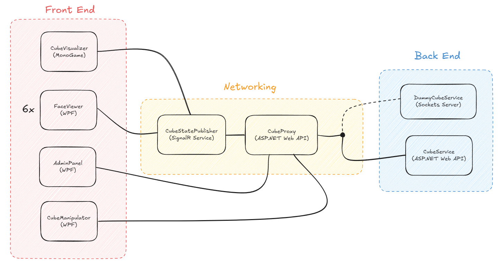

# netcube

A light-hearted networking exercise with a Rubik's cube theme.

The cube is presented as a dice-map in the same manner as used for [Old Pochman](https://www.speedcubereview.com/blind-solving-algorithms.html)

#### Screenshot

#### Design

